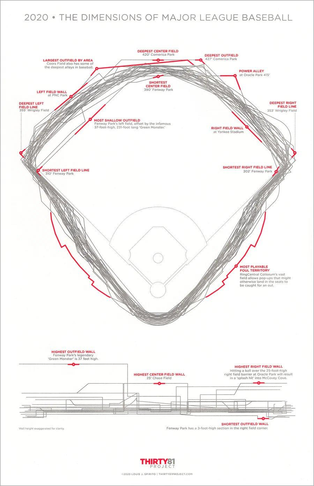

### Key Findings

Overall, both models demonstrated strong predictive capability in modeling batted-ball outcomes, despite the limited number of input features we chose to include in our dataset. The linear regression approach effectively approximated expected batting average (xBA), achieving solid accuracy and highlighting certain characteristics as more or less influential.

The logistic regression model outperformed in the classification version of this task, achieving a high ROC-AUC and a balanced weighted F1 score. By dyanmically optimizing the classification threshold, the model achieved high precision on hits while maintaining excellent recall on non-hits, indicating reliable discrimination between outcomes.

These results suggest that while linear regression provides valuable interpretability for estimating continuous outcomes like xBA, logistic regression offers superior performance for decision-based predictions. This is especially valuable in a sport like baseball, where context and situational factors play a significant role and lead to large amounts of variability. Together, the models reinforce the importance of batted-ball quality metrics in determining hitting success, while also highlighting the inherent randomness not captured by the dataset.

### Limitations and Future Research

While our models show that xBA can be consistently predicted and used to confidently quantify hitting success (to a certain extent), there are still limitations with our methods.

* Every stadium in baseball has unique dimensions, and while we standardized hit location coordinates, they can be used to create different models for each stadium. For instance, Fenway Park (The home of the Boston Red Sox), has an abnormally high left field wall, which may make batted balls with an increased launch angle more likely to be hits.

  

* Future iterations of this experiment could also look at defensive stats by team to see who had above or below average success fielding the ball, and how that might change the xBA of opposing teams. This is especially relevant since our feature set only included batted-ball characteristics, and did not take into account the many other factors at play during a single plate appearance.

* Lastly, our final dataset may have exhibited some survivorship bias since we filtered by players who had at least 50 plate appearances in 2025. This was done to normalize season stats (which are especially volatile at the start of a new season) at the potential cost of obscuring our models’ ability to predict on less proficient hitters. If a certain trend or common theme exists among players with worse hitting success, it may not be fully cpatured since those players will then play less, and be underrepresented in the dataset. Expanding the dataset to include more, or even all players, would allow us to evaluate this potential bias and see if the models perform differently, though this would also require more computational power and regularization to avoid overfitting on the increased noise in the data.
