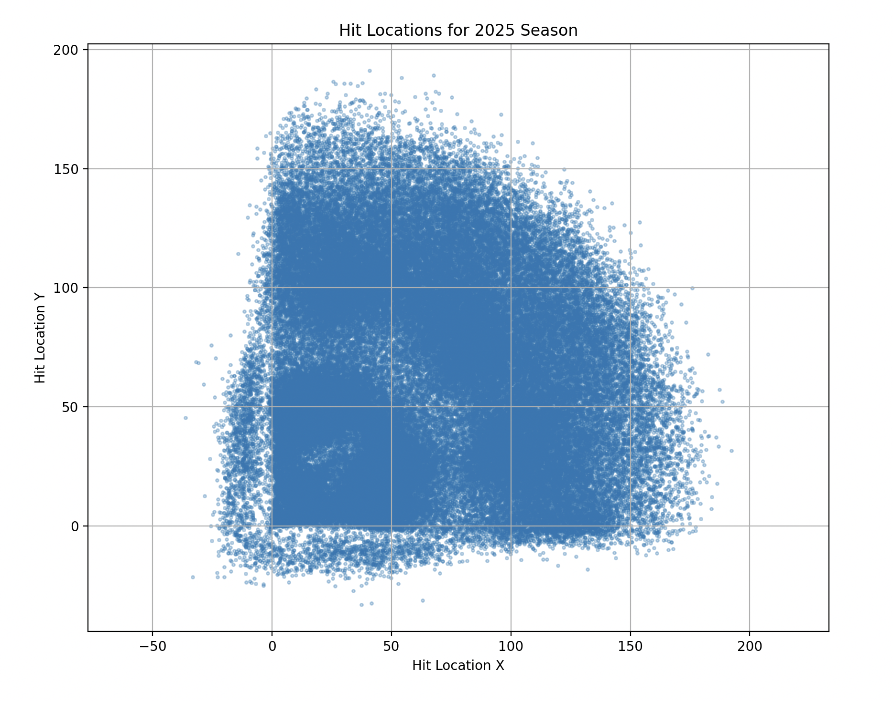

### Scraping

To scrape our data for this project, we are using the pybaseball library. This module contains a multitude of all-purpose functions to access the BaseballReference and Baseball Savant datasets. Through the MLB's Statcast system, this gives us data for every pitch from the 2025 MLB season with 118 variables, including pitcher and batter ID, pitch type, the result of the pitch, larger game and context data, etc.

The pybaseball call we used was:
"all_pitches = statcast('2025-03-27', '2025-09-28')"

```{python}
#| label: data-preview
#| echo: false
import pandas as pd
data = pd.read_csv("../data/2025_all_pitches_preview.csv")
data.head()
```

After filtering by pitches that resulted in the end of an at-bat, this gave us 183,092 baseball events.

### Data Cleaning

Further data cleaning steps include filtering by only pitches that resulted in a ball in play (i.e. that have a valid xBA value), removing walks and strikeouts, and standardizing hit location coordinates to better visualize certain features.



We then had to choose a versatile mix of input features to use for our modeling. We wanted to include a mix of features that describe the pitch itself, as well as the resulting hit. The dataset also includes metadata about the game, including player and team IDs, and xBA as the outcome/predictive variable.

Eventually, our final feature set included 122,071 observations with 7 input values as well as some metadata and labeling features.

### Final Codebook

| Variable Name | Description | Type | Values / Notes |
|---------------|-------------|------|----------------|
| game_pk | Unique identifier for each game | Categorical | 6 digit ID code |
| batter | Unique identifier for each batter | Categorical | 6 digit ID code |
| pitcher | Unique identifier for each pitcher | Categorical | 6 digit ID code |
| launch_speed | Speed of the ball off of the bat | Numerical | Measured in miles per hour | 
| launch_angle | Vertical angle of the ball off of the bat | Numerical | Measured in degrees; negative = downward, positive = upward |
| hit_distance | Distance or estimated distance ball traveled in air before hitting the ground | Numerical | Measured in feet; estimated for home runs that landed in the stands |
| hit_location_x | x coordinate of the location where the ball first landed | Numerical | location; used to estimate the direction that the ball was hit |
| hit_location_y | y coordinate of the location where the ball first landed | Numerical | location; used to estimate the direction that the ball was hit |
| pitch_speed | Speed of the pitch at release | Numerical | Measured in mph |
| release_spin_rate | Rotation of the ball at release | Numerical | Measured in rotations per minute (rpm) |
| xBA | Expected batting average | Numerical (proportion) | Range 0-1; Statcast metric that measures the probability that a ball with the given launch speed and angle will result in a hit |
| events | Result of the play | Categorical | single, double, triple, home_run, field_out, force_out, grounded_into_double_play, etc |
| team | Batting team name | Categorical | 3-letter MLB team name abbreviations (e.g., BOS = Boston Red Sox, NYY = New York Yankees) |
| hit | Records if a hit occurs | Binary | 0-1; 0 = out, 1 = hit |

: Codebook {#tbl-codebook}