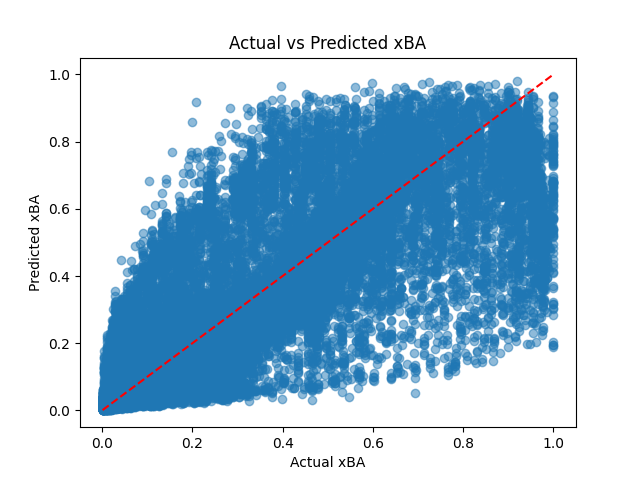
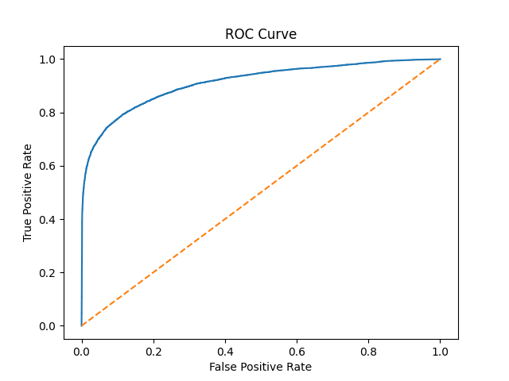

### Linear Regression Results

The output of our linear regression model was a continuous probability score for each batted ball, which we can interpret as the model's estimate of the expected batting average (xBA) for that particular hit. Under these conditions, the model achieved an MSE of approximately 0.030 and an R^2 value of around 0.627 on the test set.

This is relatively accurate, especially considering the multitude of features not included in our dataset that can also factor into whether a batted ball results in a hit.

We can interpret which features were the most heavily weighed in this model by looking at the strongest coefficients:
hit_distance: 3.6980
launch_speed2: 2.9889
launch_angle * hit_distance: -2.8950
launch_speed: -2.2277
hit_location_x2: 1.5922

From this, we can see that exit velocity heavily impacts predicted xBA, while launch angle does not, despite both being factored into the actual (unknown) formula for xBA.

### Logistic Regression Results

The best logistic regression model used a classification threshold of 0.63, which yielded a confusion matrix of:

* 15,294 true negatives
* 1,190 false positives
* 2,023 false negatives
* 5,908 true positives

Other notable results from the classification report included a precision of 0.91 on the "hit" class, and a recall of 0.99 on the "non-hit" class. The F1 score for the negative class was 0.89, and the model had a final weighted average F1 score of 0.84.

Additionally, the model achieved an ROC-AUC score of ~0.912, which is a measure of significant predictive efficiency - it can correctly rank a randomly chosen hit higher than a randomly chosen non-hit about 91.2% of the time (which is also much more accurate than linear regression model).